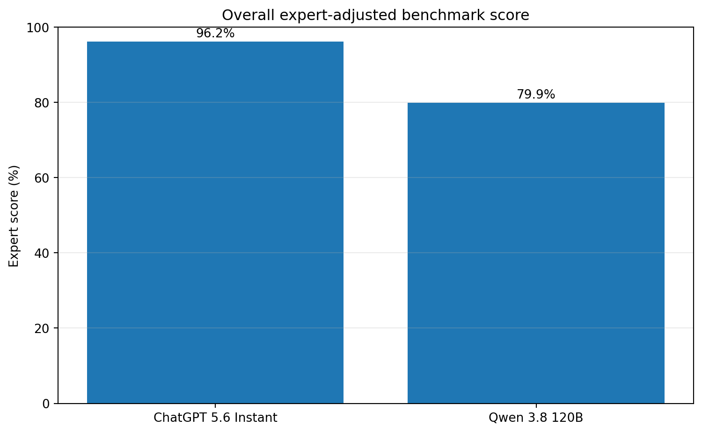
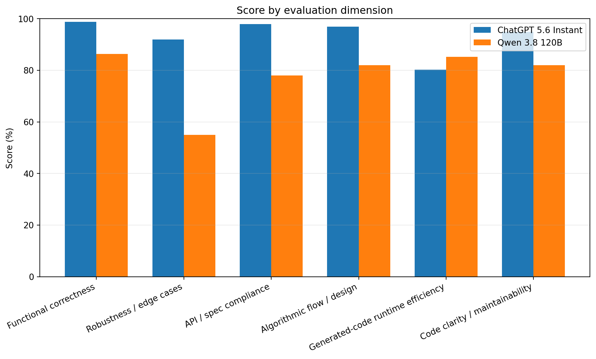
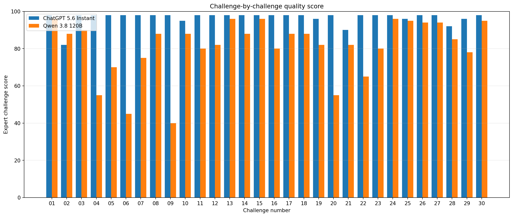
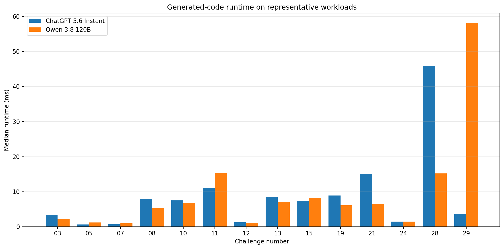
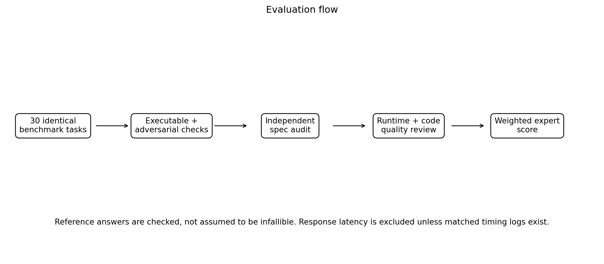

# AI-CV Programming Benchmark: ChatGPT 5.6 Instant vs Qwen 3.8 120B

This repository contains a comparison of two language models on **30 programming challenges**
focused on artificial intelligence and computer vision.

The structure and headline results are preserved from the original report.  
This updated version mainly adds methodological explanation, limitations, execution conditions,
and the planned follow-up experiment so the interpretation is clearer.

## Important note about benchmark construction

The initial question pool was prepared with assistance from several **cloud chatbots and DeepSeek**,
then reviewed and filtered so that the final set would be as general and model-independent as possible.

Even with this review, the benchmark may still contain:

- Question-author bias
- Reference-answer bias
- Judge/evaluation bias
- Bias caused by the limited number and type of tasks

For that reason, the percentages in this repository should be interpreted as **results on this benchmark**,
not as universal model accuracy.

## Models

| Model | Configuration used in this benchmark |
|---|---|
| ChatGPT 5.6 Instant | ChatGPT 5.6, Instant mode |
| Qwen 3.8 120B | Qwen 3.8, 120B parameters |

The parameter count is included only as descriptive model information and is **not used as a scoring factor**.

## Benchmark scope

The benchmark contains 30 English programming challenges covering:

- NumPy
- OpenCV
- PyTorch
- Object detection
- Segmentation
- 3D vision
- Depth and stereo vision
- Camera geometry
- Transformer components
- Metric learning
- Training utilities
- Tracking
- LoRA

The benchmark source is available in:

`benchmark_ai_cv_clean.json`

## Evaluation methodology

The final comparison is **not based only on literal similarity to a reference answer**.

The same scoring structure as the original report is retained:

| Dimension | Weight |
|---|---:|
| Functional correctness | 50% |
| Robustness / edge cases | 15% |
| API / specification compliance | 10% |
| Algorithmic flow / design | 10% |
| Generated-code runtime efficiency | 5% |
| Code clarity / maintainability | 10% |

### Functional correctness

The implementation was checked against the requested behavior, expected outputs,
and the main logic required by the task.

### Robustness / edge cases

The review considered cases such as invalid shapes, empty inputs, degenerate values,
boundary conditions, NaN/Inf cases, and unusual but valid inputs.

### API / specification compliance

Function signatures, return types, dtypes, requested libraries, and explicit constraints
in the problem statement were checked.

### Algorithmic flow / design

The underlying algorithm, ordering of operations, and conceptual suitability of the approach
were reviewed.

### Generated-code runtime efficiency

Where meaningful, generated solutions were run on representative workloads.

This refers to **execution speed of the generated program**, not to how quickly the language model generated its answer.

### Code clarity / maintainability

Readability, unnecessary complexity, structure, error handling, and maintainability were considered.

## Reference-answer policy

Reference implementations were treated as **evaluation aids rather than infallible ground truth**.

During the second review, at least one practical issue was identified in the reference behavior itself.
For example, using a scalar OpenCV border value for a multi-channel image does not necessarily
produce the intended equal padding value across all channels.

Therefore, simply matching the reference implementation was **not sufficient for a perfect score**.

## Final results

| Metric | ChatGPT 5.6 Instant | Qwen 3.8 120B |
|---|---:|---:|
| Functional correctness | **98.8%** | **86.4%** |
| Robustness / edge cases | **92.0%** | **55.0%** |
| API / specification compliance | **98.0%** | **78.0%** |
| Algorithmic flow / design | **97.0%** | **82.0%** |
| Generated-code runtime efficiency | 80.2% | **85.2%** |
| Code clarity / maintainability | **95.0%** | 82.0% |
| **Overall expert-adjusted score** | **96.2%** | **79.9%** |
| Average challenge-level quality | 96.7% | 81.1% |

### Overall score



### Score by evaluation dimension



### Challenge-by-challenge comparison



### Generated-code runtime



## Important execution-condition note

The two systems were **not served under equivalent hardware conditions**.

### Qwen 3.8 120B

Qwen was executed on constrained/self-hosted hardware.

Long reasoning made some questions very slow and several answers were initially missing.
To complete the benchmark, the Qwen run required a tighter generation budget and reduced/disabled thinking
during the recovery of missing tasks.

This means Qwen's observed answer-generation speed reflects both the model and the local serving environment.

### ChatGPT 5.6 Instant

ChatGPT was accessed through cloud infrastructure.

Its serving hardware and software stack were therefore fundamentally different from the Qwen environment.

### Consequence for speed comparison

For this reason, **model response-generation latency is not included as a formal numeric comparison in the final score**.

The published runtime dimension refers only to the **execution efficiency of the generated code**.

## Output-length note

Qwen generally produced longer stored answers than ChatGPT in this experiment.

However, exact API tokenizer counts were not captured in a strictly comparable way for both systems,
so response length should be interpreted descriptively rather than as exact model-token usage.

## Important findings

### ChatGPT 5.6 Instant

The strongest results were observed in functional correctness, API compliance,
algorithmic consistency, and code clarity.

Identified weaknesses include:

- `AICV-02`: scalar OpenCV letterbox padding is not fully robust for multi-channel images.
- `AICV-21`: fractional class IDs may be silently converted instead of rejected.
- `AICV-28`: NaN confidence values are not explicitly rejected.

These issues are among the reasons the model was **not assigned a perfect score**.

### Qwen 3.8 120B

Qwen produced many valid normal-path solutions and was competitive in generated-code execution speed.

The largest score reductions came from specification mismatches and edge cases, including:

- `AICV-04`: continuous-coordinate NMS behavior.
- `AICV-05`: background/foreground interpretation.
- `AICV-06`: binary-mask output convention.
- `AICV-07`: negative non-zero mask handling.
- `AICV-09`: perspective-rectification return format.
- `AICV-20`: zero-distance same-class positives.
- `AICV-22`: validation in EMA updates.
- `AICV-23`: gradient-accumulation memory behavior.
- `AICV-29`: tracker input validation.

## Evaluation flow



The evaluation follows this sequence:

1. The same 30 benchmark tasks are presented to both models.
2. Solutions are checked using executable and adversarial cases.
3. Requirements and API behavior are reviewed.
4. Code quality and generated-code runtime are reviewed.
5. Scores are combined using the published weights.

## Repository contents

```text
.
├── README.md
├── benchmark_ai_cv_clean.json
├── chatgpt_5_6_instant_answers.json
├── qwen_3_8_120b_answers.json
├── evaluation_summary_revised.json
├── challenge_level_expert_scores.csv
├── comparison_report_revised.html
├── overall_expert_score.png
├── dimension_scores.png
├── challenge_scores.png
├── runtime_benchmark.png
├── evaluation_flowchart.png
└── METHODOLOGY_AND_LIMITATIONS.md
```

## Reproducibility and interpretation

The raw answer files preserve the generated implementations used in the comparison.

The final score contains both deterministic checks and structured technical review,
so this repository should be interpreted as a **benchmark-specific engineering comparison**
rather than a universal ranking.

The evaluation process is documented so that the assumptions and limitations are visible,
but some judgment remains in robustness, code-quality, and algorithmic-review dimensions.

## Limitations

- Only 30 AI/CV programming tasks are included.
- The benchmark emphasizes Python, NumPy, OpenCV, and PyTorch.
- The original question pool was assisted by chatbots and may contain question-author bias.
- Reference implementations may contain imperfections.
- Some evaluation dimensions require technical judgment and are not fully automatic.
- ChatGPT and Qwen were not served on equivalent infrastructure.
- Qwen required output/reasoning constraints for completion of missing tasks.
- Model response latency is therefore not directly comparable.
- Results may change with different prompts, sampling settings, serving engines, quantization, or model versions.
- The percentages should not be interpreted as universal model accuracy.

## Planned next experiment: Cross-Evaluation

The next experiment is intended to reduce **question-author bias, reference bias, and judge bias**.

Planned design:

1. Create one question set authored from the **ChatGPT side**.
2. Give those questions to **Qwen** without reference answers.
3. Create a second question set authored from the **Qwen side**.
4. Give those questions to **ChatGPT** without reference answers.
5. Use the same evaluation rubric and hidden validation approach.
6. Compare whether the ranking remains stable after reversing question authorship.

If the result remains similar in both directions, confidence in the comparison will increase.
If the ranking changes substantially, that would indicate that benchmark construction has a significant effect.

## Full report

Open:

`comparison_report_revised.html`

for the detailed comparison, charts, score table, runtime results, and task-level findings.

## GitHub

https://github.com/Eparcham/chatgpt-vs-qwen-ai-cv-benchmark/tree/master

## Suggested interpretation when sharing

> AI-CV Programming Benchmark — a 30-task engineering comparison of ChatGPT 5.6 Instant and Qwen 3.8 120B using functional correctness, robustness, specification compliance, algorithmic design, generated-code runtime, and maintainability under non-identical serving conditions.

Avoid presenting the percentages as universal model accuracy.
