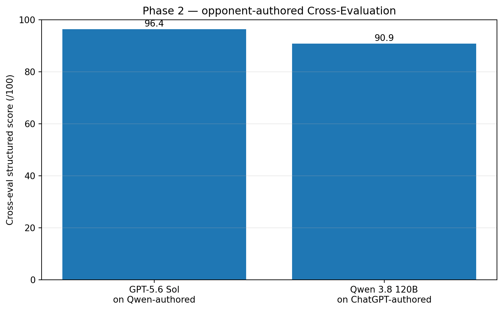
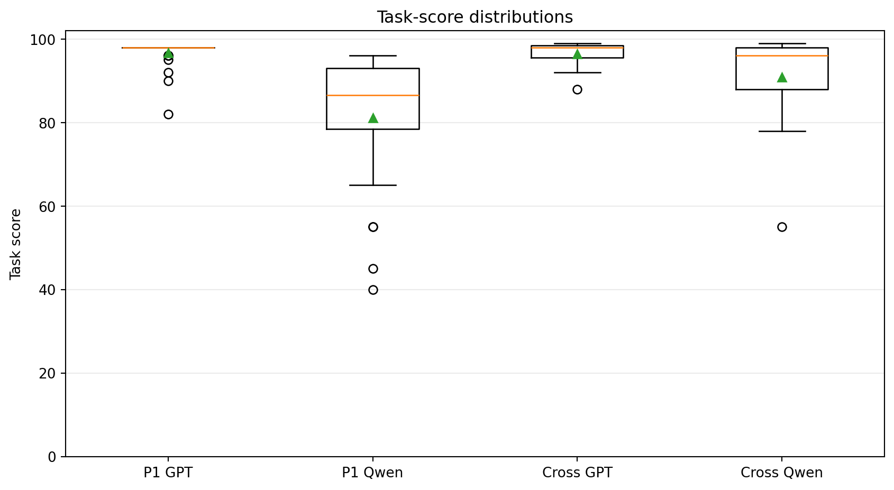
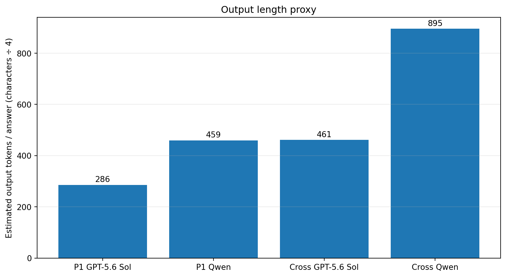
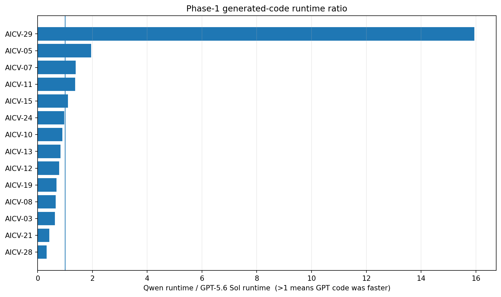
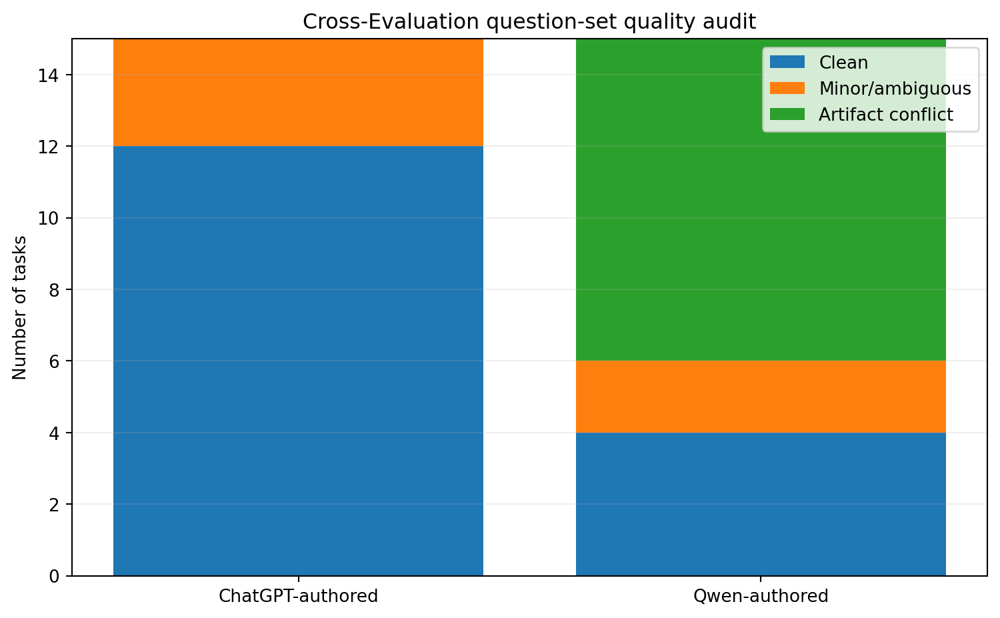

# GPT-5.6 Sol vs Qwen 3.8 120B
## A practical AI/CV code-generation benchmark for research and engineering

This repository started with a practical question:

> **If a research team uses an LLM every day for AI/CV work, which setup is more useful in practice—not only on correctness, but also on consistency, output size, code quality, benchmark reliability, and operational effort?**

We ran two related experiments:

1. **Phase 1:** both systems answered the same 30 AI/CV programming tasks.
2. **Cross-Evaluation:** each side answered 15 new tasks authored by the other side.

The repository includes the questions, raw answers, reference/test variants, task-level reviews, runtime measurements, output-length analysis, question-quality audit, and reproducibility scripts.

---

## Results at a glance

| Experiment | GPT-5.6 Sol | Qwen 3.8 120B |
|---|---:|---:|
| Shared 30-task benchmark | **96.2%** | **79.9%** |
| Cross-Evaluation | **96.4/100** | **90.9/100** |

The first experiment showed a **16.3-point** gap. The Cross-Evaluation reduced that to **5.5 points**.

That reduction matters: it shows that the exact size of the gap depends on how the benchmark is constructed.



---

## What the numbers felt like in practice

The headline scores tell only part of the story. GPT-5.6 Sol was not just higher on average; it was also more consistent across tasks.

| Run | Mean task score | SD | Minimum | Tasks scoring 90+ |
|---|---:|---:|---:|---:|
| Phase 1 — GPT-5.6 Sol | 96.7 | 3.4 | 82 | 29/30 |
| Phase 1 — Qwen 3.8 120B | 81.1 | 15.3 | 40 | 9/30 |
| Cross — GPT-5.6 Sol | 96.4 | 3.2 | 88 | 14/15 |
| Cross — Qwen 3.8 120B | 90.9 | 11.7 | 55 | 10/15 |

A simple interpretation:

- Qwen often produced strong answers.
- But its score distribution had a **longer lower tail**: a few tasks fell much further than the rest.
- GPT-5.6 Sol made fewer large mistakes in these benchmark sets.



---

## Output length: Qwen was noticeably more verbose

Exact provider token accounting was not recorded in a comparable way, so this repository does **not** claim exact API token counts.

Instead, it stores exact character counts, whitespace units, Python lexical tokens, code lines, and a transparent common length proxy:

> **Estimated LLM tokens = ceil(stored characters / 4)**

| Run | Mean characters | Estimated tokens* | Mean code lines |
|---|---:|---:|---:|
| Phase 1 — GPT-5.6 Sol | 1141 | 286 | 27.6 |
| Phase 1 — Qwen 3.8 120B | 1836 | 459 | 40.7 |
| Cross — GPT-5.6 Sol | 1844 | 461 | 39.7 |
| Cross — Qwen 3.8 120B | 3578 | 895 | 67.8 |

`*` Length proxy only; not provider billing/tokenizer output.

In practical terms:

- Qwen produced about **1.61×** as much answer text in Phase 1.
- In Cross-Evaluation, that increased to about **1.94×**.
- Its generated code was about **1.47×** longer in Phase 1 and **1.71×** longer in Cross-Evaluation.

Longer is not automatically worse. Sometimes more explanation is useful. But for an engineer reviewing dozens of model outputs, **more text and more code also mean more material to inspect, verify, and maintain**.

In these samples, longer answers did **not** show a positive relationship with higher scores.



---

## Generated-code runtime was close overall

The archived Phase-1 runtime test contains 14 representative workloads:

- GPT-generated code was faster on **5/14**.
- Qwen-generated code was faster on **9/14**.
- The geometric-mean `Qwen runtime / GPT runtime` ratio was **1.031×**, close to parity.

So the main difference we observed was **not** “GPT always writes faster code.”

The more visible differences were correctness, robustness, consistency, answer length, and workflow overhead.



---

## Cross-Evaluation also tested the benchmark creators

| Question author | Clean | Minor / ambiguous | Prompt/example/test/reference conflicts |
|---|---:|---:|---:|
| ChatGPT side | 12 | 3 | 0 |
| Qwen | 4 | 2 | 9 |

Several Qwen-authored tasks had conflicts between the prompt, examples, private grader descriptions, or generated reference implementation. That matters because a benchmark can produce a misleading score if the reference answer is treated as unquestionable ground truth.

Our scoring policy therefore used:

1. the written specification,
2. executable checks where possible,
3. reference code only after auditing it,
4. explicit notes when artifacts disagreed.



---

## Question-writing style was very different

| Metric | ChatGPT-authored | Qwen-authored |
|---|---:|---:|
| Mean public-question characters | 425 | 1969 |
| Estimated question tokens* | 107 | 493 |
| Mean requirements | 4.5 | 7.2 |
| Mean public examples | 1.0 | 2.5 |
| Mean reference-code lines | 8.7 | 56.2 |

Qwen-authored public tasks were roughly **4.6× longer**, and their reference implementations were roughly **6.5× longer**.

That does **not** prove that verbosity caused the artifact conflicts. It simply shows that the two systems approached benchmark construction very differently.

---

# Practical R&D takeaway

For our research workflow, the most important conclusion is broader than the benchmark score.

### If the main goal is to move research forward quickly

For activities such as:

- exploring an idea,
- reading and discussing papers,
- designing experiments,
- writing and debugging Python,
- reviewing AI/CV pipelines,
- generating test cases,
- comparing alternatives,
- and iterating on code,

a managed cloud chatbot such as **ChatGPT** was the more practical workflow in this experiment.

The reason is not only model quality.

With the self-hosted Qwen setup, the team also had to manage:

- inference serving,
- worker count,
- retries,
- incomplete or malformed JSON,
- resume logic,
- token/output limits,
- server capacity,
- and failed-generation recovery.

Those are solvable engineering problems, but they consume researcher time.

With a managed chatbot, most of that infrastructure burden disappears. The researcher spends more time on the experiment and less time maintaining the model-serving pipeline.

### When an internal model still makes sense

A self-hosted model remains valuable when the project has requirements such as:

- sensitive or regulated data,
- strict on-premise/offline operation,
- full control over model and inference stack,
- custom fine-tuning or specialized checkpoints,
- predictable internal deployment,
- or avoiding dependency on an external provider.

So the practical conclusion is **not** “never use an internal model.”

It is:

> **For general research and day-to-day R&D, when privacy or on-premise constraints are not the dominant requirement, a strong managed chatbot can offer a better overall research workflow because it combines high answer quality with much lower serving and maintenance overhead.**

For our setup, GPT-5.6 Sol also produced higher benchmark scores and generally shorter, easier-to-review outputs.

### Important speed caveat

We did **not** run a hardware-matched model-latency benchmark.

Qwen was self-hosted and GPT-5.6 Sol was accessed through a managed product, so raw response times mix model behavior with infrastructure.

The operational conclusion above is therefore based on the **end-to-end user/researcher workflow we actually experienced**, not on a claim that one model has intrinsically lower inference latency on identical hardware.

---

## Evaluation rubric

| Dimension | Weight |
|---|---:|
| Functional correctness | 50 |
| Robustness / edge cases | 15 |
| API / specification compliance | 10 |
| Algorithmic flow / design | 10 |
| Generated-code runtime efficiency | 5 |
| Code clarity / maintainability | 10 |

Full methodology: [`evaluation/SCORING_METHODOLOGY.md`](evaluation/SCORING_METHODOLOGY.md)

---

## Repository structure

```text
initial_benchmark/      original 30-task benchmark
chatgpt/                GPT-5.6 Sol answers and ChatGPT-side Cross-Eval data
qwen/                   Qwen answers, Qwen-authored data and authoring trace
evaluation/             scores, audits, runtime, output-size and statistical analysis
report/                 full English HTML report and charts
tools/                  validation and recomputation scripts
```

## Reproduce the checks

```bash
python tools/validate_repository.py
python tools/recompute_scores.py
python tools/analyze_output_metrics.py
```

## Full report

Open [`report/index.html`](report/index.html).

---

## Final conclusion

This benchmark does not establish a universal ranking of LLM intelligence.

What it does show is that, **for these AI/CV programming tasks and this research workflow**:

- GPT-5.6 Sol scored higher in both evaluation phases.
- GPT-5.6 Sol was more consistent, with fewer severe low-scoring failures.
- Qwen often produced good code and was faster on more of the small runtime workloads, so it remains technically capable.
- Qwen responses were substantially longer and required more review.
- Benchmark construction quality had a large effect on the measured result.
- Operating the internal model added meaningful serving and recovery overhead to the research process.

For a research team whose priority is **fast iteration and researcher productivity**, and where external-cloud use is acceptable, our experience favors using a strong managed chatbot such as ChatGPT as the default research assistant—while keeping self-hosted models for cases where privacy, control, customization, or offline deployment justify the added operational cost.
